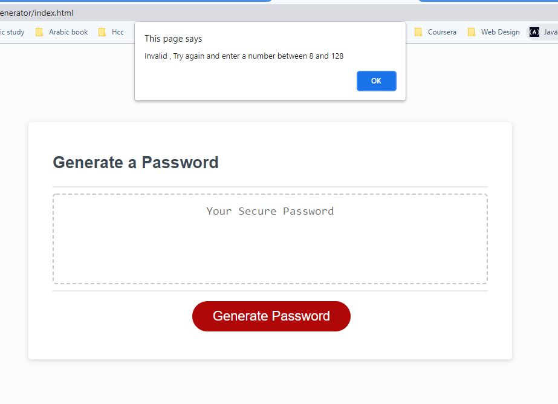

# Password Generator

## Purpose: Generate a Random Password from 8 to 128

### Description: 
Clicking on Generate a password would prompt and confirms the following:
* Prompts for adding the password length.
* Confirm if the password will have numbers.
* Confirm if the password will have lowercase characters.
* Confirm if the password will have uppercase characters.
* Confirm if the password will have special characters.

## Instructions:
If the user enter a number greater than 128 or smaller than 8, 
alert will show and the user should start over again by clicking on Generate Password again.   

## Website
 https://ghaliarose89.github.io/Ghalia-portfolio/

### Contribution
Made with ❤️️ by Ghalia

### ©️ [2021] [Ghalia Sami]
